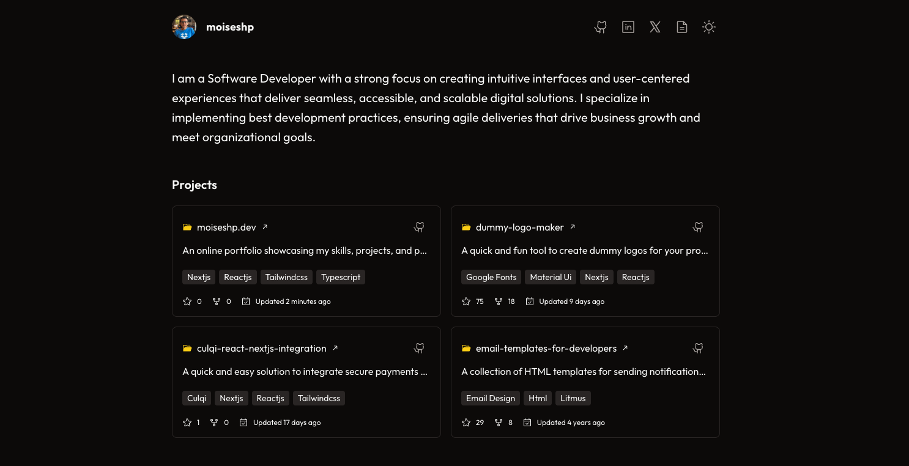

<div align="center" style="background: #fafafa; padding: 24px;">
  
</div>

<h1 align="center">My Personal Website</h1>

<p align="center">
  Welcome to my personal website repository! This project showcases my portfolio as a Software Developer, including sections for my projects and professional experiences.
</p>

<div align="center">
  <a href="https://moiseshp.vercel.app/" target="_blank">
    Live Demo
  </a>
  <span>/</span>
  <a href="https://github.com/moiseshp/moiseshp.dev?tab=readme-ov-file#-stack">
    Stack
  </a>
  <span>/</span>
  <a href="https://github.com/moiseshp/moiseshp.dev?tab=readme-ov-file#-contributing">
    Contribute
  </a>
</div>

<br />

<div align="center">


</div>

## 📦 Stack

- [**Next.js**](https://nextjs.org/docs) - The React Framework for the Web.
- [**Typescript**](https://www.typescriptlang.org/) - JavaScript with syntax for types.
- [**Tailwindcss**](https://tailwindcss.com/) - A utility-first CSS framework.
- [**Phosphor Icons**](https://phosphoricons.com/) - Phosphor is a flexible icon family.

## 🤝 Contributing

1. [Fork](https://github.com/moiseshp/moiseshp.dev/fork) the repository.

2. Install dependencies:

```bash
# and install dependencies:
npm install
```

3. Run the development server:

```bash
npm run dev
```

Open up [http://localhost:3000](http://localhost:3000) and make your changes ✨.

## 📄 License

This project is licensed under the MIT License. See the [LICENSE](LICENSE) file for details.

## 🚀 Deploy on Vercel

The easiest way to deploy your Next.js app is to use the [Vercel Platform](https://vercel.com/new?utm_medium=default-template&filter=next.js&utm_source=create-next-app&utm_campaign=create-next-app-readme) from the creators of Next.js.

Check out our [Next.js deployment documentation](https://nextjs.org/docs/app/building-your-application/deploying) for more details.
