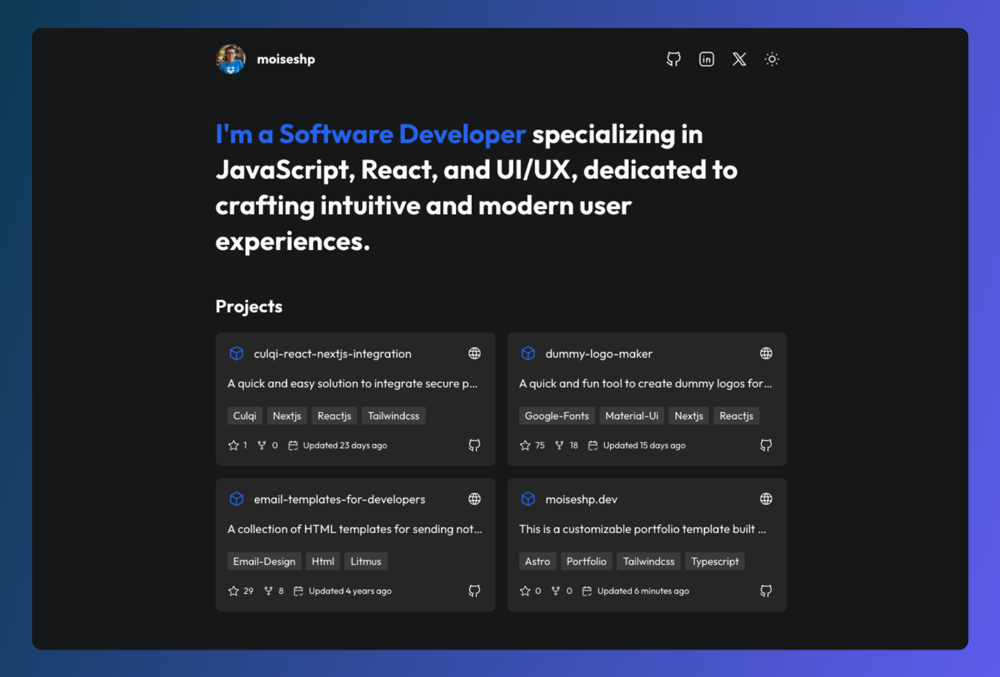

<div align="center">
  
</div>

<h1 align="center">Astro Portfolio Template 🚀</h1>

<p align="center">
This is a customizable portfolio template built with <a href="https://astro.build/" target="_blank">Astro</a>. Whether you're a developer, designer, or creative professional, this template is designed to help you showcase your work in style. You can also use it as a starting point for your own projects or as a personal portfolio.

</p>

<div align="center">
  <a href="https://moiseshp.dev" target="_blank">
    Live Demo
  </a>
  <span>/</span>
  <a href="https://github.com/moiseshp/moiseshp.dev?tab=readme-ov-file#-features">
    Features
  </a>
  <span>/</span>
  <a href="https://github.com/moiseshp/moiseshp.dev?tab=readme-ov-file#-stack">
    Stack
  </a>
  <span>/</span>
  <a href="https://github.com/moiseshp/moiseshp.dev?tab=readme-ov-file#-deployment">
    Deployment
  </a>
</div>

<br />

<div align="center">


</div>

## 🌟 Features

- Fully customizable portfolio design.
- Built with Astro, a modern static site builder.
- Responsive design that looks great on any device.
- Support for custom servers and seamless deployment to Vercel or other hosting providers.
- Easy to clone and use as a template for your projects.
- Show experiences in an interactive timeline UI, presenting events or milestones in a visually engaging way.
- List your GitHub projects with details like project name, description, and direct links to the repositories.

## 📦 Stack

- [**Astro**](https://astro.build) - The web framework for content-driven websites.
- [**Typescript**](https://www.typescriptlang.org/) - JavaScript with syntax for types.
- [**Tailwindcss**](https://tailwindcss.com/) - A utility-first CSS framework.

## 🛠️ Getting Started

1. Clone the Repository

```bash
git clone https://github.com/moiseshp/moiseshp.dev.git
```

2. Install Dependencies

```bash
npm install
```

2. Run the Development Server

```bash
npm run dev
```

Open your browser and navigate to http://localhost:4321 to view your site.

## 🚀 Deployment

You can deploy your portfolio easily using any hosting service Astro supports. Here are two popular options:

### **Option 1: Vercel**

1. Sign up at [Vercel](https://vercel.com/).
2. Import your repository.
3. Vercel will handle the deployment for you.

### **Option 2: Custom Server**

Astro allows you to deploy to custom servers. For more details, refer to the [Astro deployment documentation](https://docs.astro.build/en/guides/deploy/).

## 🤝 Contributing

If you find this template useful, feel free to leave a star ⭐️! Contributions, issues, and feedback are welcome.

### Additional Resources

- [Astro Documentation](https://docs.astro.build/)
- [Deploying Astro Projects](https://docs.astro.build/en/guides/deploy/)

## 📄 License

This project is licensed under the **MIT License**. Feel free to use, modify, and distribute it as you wish. See the full license text in the [LICENSE](LICENSE) file.
